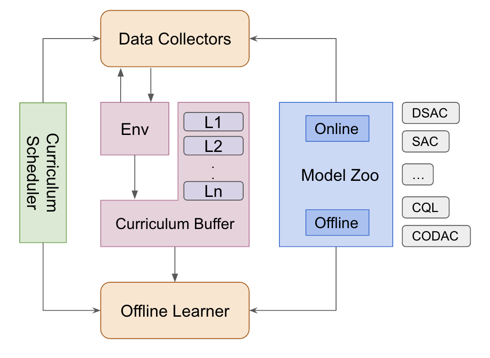

# OR2AC

This is the implementation for my undergrad Final Year Project “Offline Risk-Averse Actor-Critic with Curriculum Learning”.


## Project Description
In real-world scenarios, [Offline RL](https://arxiv.org/abs/2005.01643) has emerged as a preferable approach as it allows policy learning solely from historical data, eliminating the need for environmental interactions during learning. However, deploying offline RL presents multiple challenges, particularly in policy safety, handling out-of-distribution state-action pairs, and policy generalization. To address these, this project advances risk-averse and generalizable offline RL algorithms, enhancing real-world applicability. 


This code implements several RL algorithms to foster risk-sensitive RL agents as baselines, including
- [SAC](https://arxiv.org/abs/1801.01290)
- [DSAC](https://arxiv.org/abs/2004.14547)
- [CODAC](https://arxiv.org/abs/2107.06106)


Here is the overview of the proposed method:

<div align="center">
    
    <p>Fig.1 Overview of OR2AC</p>
</div>

The process involves setting the performance metric and difficulty adjustment mechanism in the Curriculum Scheduler. Then, an online algorithm is selected to train the data collector and collect transitions for offline training. The collected data is used to train the offline learner using an offline algorithm from the Model Zoo. The Curriculum Scheduler controls the environment difficulty throughout the training process.


## Installation

Here are the steps to run on your machine:

1. Create and activate a conda environment, and install packages:
   ```shell
   conda create -n OR2AC python=3.9
   conda activate OR2AC
   pip install -r requirements.txt
   ```

2. Run experiments:
   First, run `train_online.py` to generate dataset for offline training:
   ```python
   python train_online.py --task_name online --env riskymassrandom --algo sac --seed 666
   ```

   Second, run `train_offline.py`:
   ```python
   python train_offline.py --task_name offline --env riskymassrandom --algo codac --seed 666 --risk_prob 0.9 --risk_penalty 50.0 --risk_type cvar --risk_param 0.1 --tau_type iqn
   ```
3. The file structure should look like this, then you can test your model using `visualize.py`
   ```
    .
    ├── env
    ├── model
    │   ├── sac.py
    │   ├── dsac.py
    │   ├── codac.py
    │   ├── networks.py
    │   └── utils.py
    ├── dataset
    │   └── task
    │       └── level
    ├── saved_policies
    │   └── task
    │       ├── online
    │       └── offline
    ├── README.md
    ├── train_online.py
    ├── train_offline.py
    ├── replay_memory.py
    └── visualize.py
    ```

## Acknowledgement
The code in this repository is based on and inspired by the work of the authors and contributors from [CODAC](https://github.com/JasonMa2016/CODAC) and [DSAC](https://github.com/xtma/dsac).
    